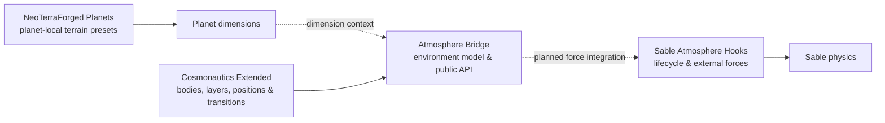

# Minecraft Planetary Environment Stack

A family of independent Minecraft 1.21.1 NeoForge modules for data-driven
planets, celestial transitions, server-authoritative atmosphere queries, and
Sable-compatible external-force integration.

> [!IMPORTANT]
> This is an experimental multi-repository project, not a turnkey modpack.
> APIs, datapack formats, compatibility requirements, and module boundaries may
> change before the first stable release.

## Architecture

`Atmosphere-Bridge` is the central environment API. `Cosmonautics-Extended`
provides celestial-body, layer, position, and transition capabilities.
`NeoTerraForged-Planets` provides independent terrain presets for custom planet
dimensions. `Sable-Atmosphere-Hooks` exposes the lifecycle and force-submission
boundary needed to apply environmental forces to Sable SubLevels.

## Modules

| Repository | Responsibility | Type | License |
| --- | --- | --- | --- |
| [Atmosphere-Bridge](https://github.com/plaeyr123/Atmosphere-Bridge) | Server-authoritative planetary environment definitions and query API | Core integration module | MPL-2.0 |
| [Cosmonautics-Extended](https://github.com/plaeyr123/Cosmonautics-Extended) | Multi-layer planets, celestial position APIs, and cross-dimension transitions | Unofficial replacement fork | GPL-3.0 |
| [NeoTerraForged-Planets](https://github.com/plaeyr123/NeoTerraForged-Planets) | Dimension-local terrain presets and planet world generation | Unofficial replacement fork | MIT |
| [Sable-Atmosphere-Hooks](https://github.com/plaeyr123/Sable-Atmosphere-Hooks) | Safe Sable lifecycle access and queued external-force submission | Compatibility module | MPL-2.0 |

## Where to start

Start with [Atmosphere-Bridge](https://github.com/plaeyr123/Atmosphere-Bridge)
for the shared data model and integration boundaries. Then open the module that
owns the capability you need:

- planetary bodies, layers, positions, and transitions: `Cosmonautics-Extended`;
- custom planet terrain generation: `NeoTerraForged-Planets`;
- Sable lifecycle and external forces: `Sable-Atmosphere-Hooks`.

Each repository is versioned, built, licensed, and tested independently. The
two replacement forks keep their upstream Mod IDs and must not be installed
beside the corresponding upstream jars.

## Compatibility snapshot

| Field | Current baseline |
| --- | --- |
| Minecraft | `1.21.1` |
| Java | `21` |
| Loader | NeoForge `21.1.x` |
| Project maturity | Experimental / alpha |
| Distribution | Separate module jars; no combined stable release yet |

Refer to each repository's README for its exact dependency versions, build
commands, installation constraints, upstream attribution, and current test
boundary.

## Project status

The repositories currently document and implement the module boundaries, but
the complete end-to-end atmosphere-to-physics path is still under active
development. In particular, Atmosphere Bridge does not yet provide a finished
supported modpack, stable public API, or completed Sable force policy.

---

Maintained by [@plaeyr123](https://github.com/plaeyr123).
